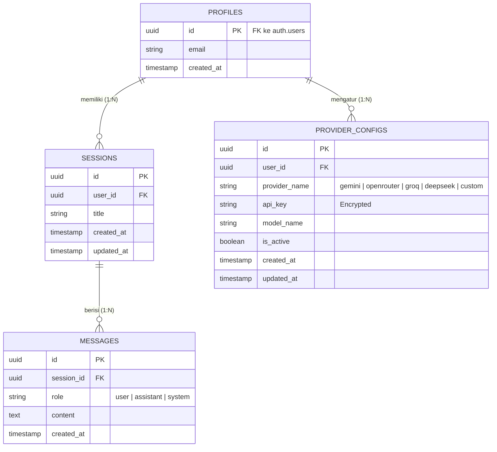

# 4️⃣ DATA_MODELS.md

```md
# DATA_MODELS.md  
Database Schema & Data Models  
Program Generate Dokumentasi Instruksi Untuk Vibecoding  

---

## 1. Konsep Database

Aplikasi ini menggunakan **Supabase (PostgreSQL)** sebagai database utama. Mengingat aplikasi ini 100% gratis pada fase awal, skema dirancang seringan dan seefisien mungkin untuk mengoptimalkan *free-tier limits*.

Sistem autentikasi menggunakan bawaan Supabase (`auth.users`), sehingga kita hanya perlu membuat tabel di skema `public` yang berelasi dengan `auth.users`.

---

## 2. Entity Relationship Diagram (ERD)

Berikut adalah relasi antar entitas menggunakan format Mermaid.js:



---

## 3. Detail Skema Tabel

### 3.1 Tabel `profiles`
Menyimpan profil publik/ekstensi dari `auth.users`.

| Field | Tipe Data | Constraint / Keterangan |
|-------|-----------|-------------------------|
| `id` | UUID | Primary Key, Foreign Key (`auth.users.id`), CASCADE |
| `email` | TEXT | Not Null, Unique |
| `created_at` | TIMESTAMPTZ | Default `now()` |

### 3.2 Tabel `sessions`
Menyimpan riwayat percakapan / sesi proyek (History).

| Field | Tipe Data | Constraint / Keterangan |
|-------|-----------|-------------------------|
| `id` | UUID | Primary Key, Default `uuid_generate_v4()` |
| `user_id` | UUID | Foreign Key (`profiles.id`), Not Null, CASCADE |
| `title` | TEXT | Not Null (Di-generate otomatis oleh AI dari prompt pertama) |
| `created_at` | TIMESTAMPTZ | Default `now()` |
| `updated_at` | TIMESTAMPTZ | Default `now()` |

### 3.3 Tabel `messages`
Menyimpan isi chat (prompt user dan response AI).

| Field | Tipe Data | Constraint / Keterangan |
|-------|-----------|-------------------------|
| `id` | UUID | Primary Key, Default `uuid_generate_v4()` |
| `session_id` | UUID | Foreign Key (`sessions.id`), Not Null, CASCADE |
| `role` | VARCHAR(20) | Not Null, Check: `role IN ('user', 'assistant', 'system')` |
| `content` | TEXT | Not Null |
| `created_at` | TIMESTAMPTZ | Default `now()` |

### 3.4 Tabel `provider_configs`
Menyimpan konfigurasi API Key dan model pilihan masing-masing user.

| Field | Tipe Data | Constraint / Keterangan |
|-------|-----------|-------------------------|
| `id` | UUID | Primary Key, Default `uuid_generate_v4()` |
| `user_id` | UUID | Foreign Key (`profiles.id`), Not Null, CASCADE |
| `provider_name` | VARCHAR(50) | Not Null (contoh: 'gemini', 'openrouter') |
| `api_key` | TEXT | Not Null (Harus dienkripsi sebelum masuk DB) |
| `model_name` | VARCHAR(100) | Not Null (contoh: 'gemini-2.5-flash') |
| `is_active` | BOOLEAN | Default `false` |
| `created_at` | TIMESTAMPTZ | Default `now()` |
| `updated_at` | TIMESTAMPTZ | Default `now()` |

---

## 4. Indeks & Keamanan (Supabase PostgreSQL)

### 4.1 Indexing
Untuk mempercepat query pembacaan history:
- `CREATE INDEX idx_sessions_user_id ON sessions(user_id);`
- `CREATE INDEX idx_messages_session_id ON messages(session_id);`
- `CREATE INDEX idx_provider_configs_user_id ON provider_configs(user_id);`

### 4.2 Row Level Security (RLS)
Setiap tabel wajib mengaktifkan RLS agar user tidak bisa melihat/mengakses sesi, pesan, atau API Key milik user lain.
- **Policy Select/Insert/Update/Delete:** `auth.uid() = user_id`

---

## 5. Draf Skema (SQL DDL untuk Supabase)

Berikut adalah skema mentah (SQL DDL) yang bisa langsung dieksekusi di *SQL Editor* Supabase:

```sql
-- Enable UUID extension
CREATE EXTENSION IF NOT EXISTS "uuid-ossp";

-- 1. Create Profiles Table
CREATE TABLE profiles (
    id UUID REFERENCES auth.users(id) ON DELETE CASCADE PRIMARY KEY,
    email TEXT UNIQUE NOT NULL,
    created_at TIMESTAMPTZ DEFAULT NOW()
);

-- 2. Create Sessions Table
CREATE TABLE sessions (
    id UUID DEFAULT uuid_generate_v4() PRIMARY KEY,
    user_id UUID REFERENCES profiles(id) ON DELETE CASCADE NOT NULL,
    title TEXT NOT NULL,
    created_at TIMESTAMPTZ DEFAULT NOW(),
    updated_at TIMESTAMPTZ DEFAULT NOW()
);

-- 3. Create Messages Table
CREATE TABLE messages (
    id UUID DEFAULT uuid_generate_v4() PRIMARY KEY,
    session_id UUID REFERENCES sessions(id) ON DELETE CASCADE NOT NULL,
    role VARCHAR(20) CHECK (role IN ('user', 'assistant', 'system')) NOT NULL,
    content TEXT NOT NULL,
    created_at TIMESTAMPTZ DEFAULT NOW()
);

-- 4. Create Provider Configs Table
CREATE TABLE provider_configs (
    id UUID DEFAULT uuid_generate_v4() PRIMARY KEY,
    user_id UUID REFERENCES profiles(id) ON DELETE CASCADE NOT NULL,
    provider_name VARCHAR(50) NOT NULL,
    api_key TEXT NOT NULL,
    model_name VARCHAR(100) NOT NULL,
    is_active BOOLEAN DEFAULT FALSE,
    created_at TIMESTAMPTZ DEFAULT NOW(),
    updated_at TIMESTAMPTZ DEFAULT NOW(),
    UNIQUE(user_id, provider_name) -- User hanya bisa punya 1 config per provider
);

-- Indexes for performance
CREATE INDEX idx_sessions_user_id ON sessions(user_id);
CREATE INDEX idx_messages_session_id ON messages(session_id);
CREATE INDEX idx_provider_configs_user_id ON provider_configs(user_id);

-- Enable RLS
ALTER TABLE profiles ENABLE ROW LEVEL SECURITY;
ALTER TABLE sessions ENABLE ROW LEVEL SECURITY;
ALTER TABLE messages ENABLE ROW LEVEL SECURITY;
ALTER TABLE provider_configs ENABLE ROW LEVEL SECURITY;

-- RLS Policies (Example for Sessions)
CREATE POLICY "Users can view own sessions" 
ON sessions FOR SELECT 
USING (auth.uid() = user_id);

CREATE POLICY "Users can insert own sessions" 
ON sessions FOR INSERT 
WITH CHECK (auth.uid() = user_id);

CREATE POLICY "Users can delete own sessions" 
ON sessions FOR DELETE 
USING (auth.uid() = user_id);
```

---